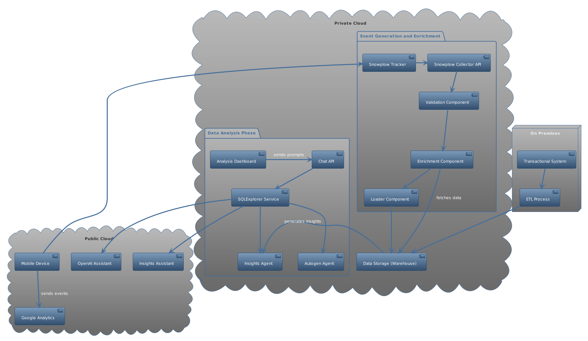
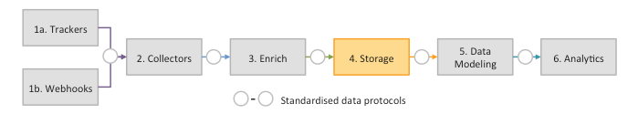

# Snowplow Analytics Pipeline

## Architecture



This is an example of an end-to-end Snowplow pipeline to track events using a Kafka broker.

The pipeline works in the following way:



1. A request is sent to the Scala Collector
2. The raw event (thift event) is put into the `snowplow_raw_good` (or bad) topic
3. The enricher grabs the raw events, parses them and put them into the `snowplow_parsed_good` (or bad) topic
4. A custom events processor grabs the parsed event, which is in a tab-delimited/json hybrid format and turns it into a proper
Json event using the python analytics SDK from Snowplow. This event is then put into a final topic called `snowplow_json_event`.
5. (WIP) A custom script grabs the final Json events and loads them into some storage solution (such as BigQuery or Redshift)


## Run the pipeline

# Note first go build the kafka-postgres loader in the snowplow-kafka-pg-loader project. consult the readme.

Execute:

```sh
docker-compose build --no-cache
docker-compose up -d
```
In addition, the schema of iglu server must be initialized.
```sh
docker-compose run iglu-server setup --config /snowplow/config/config.hocon
```
After that, make sure all the containers are up with `docker-compose ps`. If not, try to run the up again.

# Note! 

after everything is up, you can;

1. go to http://localhost/ to generate events
2. http://localhost:9021/ to see the kafka topics
3. connect localhost:5432 with user sp_user and password sp_password and the atomic schema in the igludb to see the data
4. inside index.html we will define two custom schemas mouse-move and mouse-click. these schemas need to be defined inside the schema registry as such:

# first open postman 


# inside globals will be a variable for superApikey, this is also defined inside config.hocon of iglu-server

# run the create scripts
# Note! had to also add the apikey inside resolver.json so that the validator can also read the schema

# after the schema's have been set, you are good to go. if the schemas have not been set, all messages will go to the bad topic
# if apikeys have not been set, then you will get a ""message": "Not sufficient privileges to create keys"
}" error
# if the resolver apikey is not set, you will get 
'"schemaKey": "iglu:com.example_company/mouse_move/jsonschema/1-0-0",
          "error": {
            "error": "ResolutionError", '
in the bad message topic.


This command will create all the components and also a simple web application that sends pageviews and other events to the collector.
Please checkout the `docker-compose.yml` file for more details.

## Run in production (Kubernetes)

The configuration files are using endpoints for Kafka provided by [kubernetes-kafka](https://github.com/Yolean/kubernetes-kafka). You can configure your own brokers in the collector and enrich configuration file (configmaps).

Assuming you have configured Kafka for all the components:

1. Deploy the collector: `kubectl apply -f ./k8s/collector`. This will create the configuration, deployment and a service that uses a Load Balancer to access the collector's endpoint. 
2. Deploy the enricher: `kubectl apply -f ./k8s/stream-enrich`. This will create the configurations and deployment.
3. Build a Docker image for the events processor, upload it to some registry and add it to `k8s/events-processor/deploy.yml`. Checkout the files in `k8s/events-processor` before building the image and change the broker configuration in `app.py`.
4. Deploy the events processor application using the previous `k8s/events-processor/deploy.yml` file.
5. Run the webapp example locally and change the collector's address to the load balancer IP address created for the collector. The collector is using the port 80 so remove the port and just leave the IP address.
6. Once everything is running, open the webapp and refresh the page a couple of times. Checkout the logs of the events processor pod to see if the Json events are created correctly.


# to build images:

docker buildx create --use
docker buildx inspect --bootstrap
docker buildx build --platform linux/amd64,linux/arm64 -t socrates12345/events-processor:latest --push .
